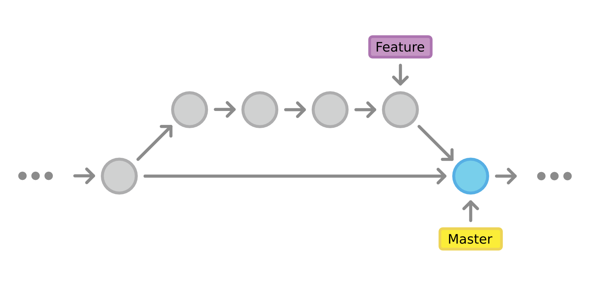

<!-- .slide: data-background="#F5AF33" -->

# Git++   Le recap

---

<!-- .slide: data-background="#F5AF33" -->

# Une conviction

Note:
Un historique propre c'est important  
Qualité dans le code  
Sérénité dans l'équipe  
Valeur pour l'utilisateur

---

## Un historique propre

---

<!-- .slide: data-background="#F5AF33" -->

# Une méthode

---

## Conventions de commit

---

<!-- .slide: data-background="img/clean-vs-dirty-water.jpg" data-background-size="cover" -->

<!-- .element: class="fullImageCaption" -->
Git merge vs rebase

---

<!-- .slide: data-background="#F5AF33" -->

# Des outils

---

<!-- .slide: class="twoColList codeTitle" -->

# `git rebase -i ?`

* Renommer
* Modifier
* Réordonner
* Fusionner
* Insérer
* Supprimer

---

<!-- .slide: data-background="img/changelog.png" data-background-size="contain" class="codeTitle" -->

<!-- .element: class="fullImageCaption" -->
`grunt changelog`
