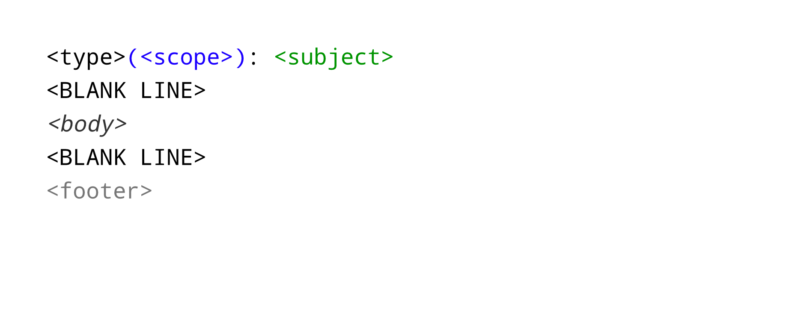

<!-- .slide: data-background="#F5AF33" -->

# Git++ :   Le recap

---

<!-- .slide: class="oneColList" -->

## Convictions

* Un historique sale :-(
* Un historique propre :-)
* Qualité dans le code
* Dévelopeurs contents

---

## Conventions de commit

